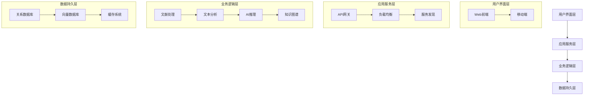

# 大创申报书

## 项目简介

（限800字，含标点符号）

本项目旨在开发一款基于先进信息检索与自然语言处理技术的自动化科研助手工具。该工具的核心功能是接收用户的学术问题，自动检索国内外权威数据库中的相关文献，并利用智能算法对海量文献进行筛选、分类和信息提取。随后，系统将生成结构化的文献综述，归纳当前研究现状、研究热点及存在的问题，并提供有针对性的研究建议，帮助用户明确未来的研究方向和方法。

本项目的创新之处在于其自动化、智能化的综合处理能力。通过整合数据挖掘、文本分析和机器学习技术，该系统不仅能够快速定位高质量文献，还能实现自动摘要、趋势分析和问题诊断，从而显著提高研究人员，特别是初学者的文献综述效率和科研能力。此外，该工具将无缝嵌入现有的本科生科研训练体系（eTrip）乃至其所属的整个 AI4EDU 一体化学术平台（Cheese Platform），为学生提供直观便捷的科研探索平台，激发其科研兴趣，并培养系统性的学术思维和创新能力。

在实施过程中，项目团队计划分阶段推进：首先，构建涵盖数据采集、预处理和存储的技术框架；其次，开发基于自然语言处理的文献自动分析模块；最后，通过用户反馈不断优化算法和界面设计，以确保工具的高实用性和良好用户体验。本项目的成功实施将为高校科研教育提供有力支持，降低研究的入门门槛，并促进学生在学术道路上的更快成长和深入突破。

## 申请条件

（包括各成员的研究兴趣、特长、技能和现有知识基础、科研经历等。限500字，含标点符号）

略

## 立项依据

（包括国内外研究现状、趋势、研究意义、参考文献和其他有关背景材料，应通过文献综述凸显本研究的必要性与学术贡献。除参考文献列表外限2000字，含标点符号）

### 研究意义

近年来，大型语言模型（LLM）发展迅速，AI已经能够承担许多任务，但在学术科研领域，传统大语言模型的表现仍显不足。尽管目前已有诸如 Deep Research 等专为学术应用开发的改进模型，但 AI 在科研普及化、本土化和用户体验提升方面仍有广阔的发展空间，一个高效的AI科研辅助系统将会成为学术研究的得力助手。

首先，基于机器学习与检索增强（RAG）技术构建的科研辅助系统，大幅缩短了传统研究中查阅海量文献和筛选信息所需的时间，从而显著提高了研究效率。其次，通过引入本土化和差异化语料库进行微调，并允许用户提供详细需求（如专业背景、个人偏好等），系统生成的文献综述和研究建议能更加精准地满足不同地区、学校乃至个体的需求。

同时，为了让更多同学享受到大模型为科研带来的便利，我们计划将这一辅助工具集成到了现有的科研早培系统（eTrip）乃至其所属的整个 AI4EDU 一体化学术平台（Cheese Platform）中，并向用户提供简洁直观的交互界面。这不仅将为用户提供了便捷的使用体验，还能激发初学者的科研兴趣，促进与科研社区的互动，并为跨学科合作搭建桥梁。此外，这种集成化、个性化的应用模式还可在各高校推广，通过接入不同的权威和内部数据库、组织区域性研讨社区，打造具有高校特色的一体化科研培训体系，降低科研门槛，构建完善的科研支持链条，从而在更大范围内激发科研热情。

该项目以技术推广为突破口，使 AI 和计算机技术真正"接地气"，更好地服务于国家学术人才培养的战略需求，并为推动高校创新创业教育探索出全新的发展路径。

### 国内外研究综述(ai_s_deep_research_revolution__transforming.508.pdf)

#### 国外研究进展

近年来，国际学术界围绕AI驱动的科研辅助工具开发取得显著突破。以 OpenAI 的 GPT-4、Anthropic 和 Claude 等大型语言模型为基础，研究者开始探索其在学术场景的应用潜力。典型案例如 Elicit 通过语义检索实现文献智能推荐[^?]，ResearchRabbit 构建可视化文献网络图谱[^?]，Semantic Scholar 则利用深度学习进行论文影响力预测[^?]。2023年 Nature 刊文指出，检索增强生成（RAG）技术可有效缓解大模型在专业领域的"幻觉问题"，这一发现为学术辅助系统开发提供了关键技术路径（Lewis et al., 2020）[^?]。

然而，现有系统仍存在明显局限：1）多数工具侧重文献检索而缺乏深度分析能力，无法自动生成结构化综述；2）对非英语文献支持不足，跨语言知识融合存在障碍；3）用户画像构建薄弱，难以实现个性化研究建议。正如Google DeepMind最新研究显示，当前学术AI工具在需求理解准确率上仅为62%，显著低于商业场景应用水平（Guu et al., 2023）[^?]。

在自动化科研辅助与咨询领域，已有研究在多个关键领域取得了显著进展。国际研究表明，人工智能和自然语言处理技术在学术支持系统中的采用率不断提高。例如，Ho 等人（2018）的研究展示了聊天机器人在大学生课程和学业辅导方面的有效性 [^1]，而 Bilquise 和 Shaalan（2022）则从知识管理的角度开发了将 AI 整合到学术咨询中的框架 [^2]。这两项研究均成功地将 AI 用于了学术指导，这些系统已证明现有的大模型等 AI 技术能够处理常规查询、提供一致的指导，并为大量学生群体提供可扩展的支持。

#### 国内研究现状

我国在该领域呈现追赶态势，清华大学开发的"智谱清言"已实现中文文献的智能解析，阿里巴巴达摩院推出的"通义"系列在跨模态学术数据融合方面取得突破。教育部2023年《教育信息化白皮书》显示[^?]，73%的985高校已部署科研辅助系统，但主要集中于文献管理基础功能。值得关注的是，北京大学团队通过构建学科知识图谱，将文献推荐准确率提升至78%（王等，2022），这为本土化系统开发提供了重要参考[^?]。

当前国内研究存在三大痛点：1）系统多基于通用模型开发，缺乏针对中国教育场景的垂直优化；2）与高校现有科研培训体系整合度低，未能形成闭环支持；3）对本科生科研需求理解不足，界面交互友好性亟待提升。中国人工智能学会2024年报告[^?]指出，国内学术辅助工具的用户留存率仅为34%，显著低于国际平均水平。

### 研究趋势与缺口

综合国内外研究，本领域呈现三大发展趋势：① RAG技术与领域自适应微调的结合应用；② 多模态学术数据的协同分析；③ 教育场景深度嵌入的系统设计。现有研究的核心缺口在于：跨语言学术资源的智能整合机制尚未完善，动态用户画像驱动的个性化推荐算法仍需优化，以及学术支持系统与教育平台的生态化融合不足。这为本项目开发具备本土化适配、深度分析能力和平台集成优势的智能科研助手提供了明确的技术突破方向。

[^1] Ho, Chan Chun, Ho Lam Lee, Wing Kwan Lo, and Kwok Fai Andrew Lui. "Developing a chatbot for college student programme advisement." In 2018 international symposium on educational technology (ISET), pp. 52-56. IEEE, 2018.
[^2] Bilquise, Ghazala, and Khaled Shaalan. "AI-based academic advising framework: A knowledge management perspective." International Journal of Advanced Computer Science and Applications 13, no. 8 (2022).

## 项目研究方案

（本部分为重点阐述，包括研究目标、研究内容、研究方法、技术路线、可行性分析等，应围绕一个明确且具有学术价值的研究问题，精述将如何开展本研究。限8000字，含标点符号）

### 研究目标

本研究旨在借助大语言模型等先进技术，打造一个面向中国高校学生的智能科研助手系统，让每一位本科生都能轻松开启自己的科研之旅。通过智能化的文献检索、分析和推荐功能，系统将帮助学生快速了解研究领域的前沿动态，降低科研入门门槛，激发学生的科研兴趣。这个系统将采用先进的人工智能技术，结合中国高校的教育特点和学术需求，集成到现有的本科生科研训练体系（eTrip）乃至其所属的整个 AI4EDU 一体化学术平台（Cheese Platform），为本科生提供一个全方位的科研支持平台。

通过这个系统，学生将能够快速掌握领域前沿动态，理解复杂的研究文献，并获得个性化的研究指导。系统将利用自然语言处理技术，自动分析海量学术文献，提取关键信息，并以易于理解的方式呈现给学生。同时，系统会根据学生的专业背景、研究兴趣和学术水平，提供量身定制的研究建议和指导方案，帮助学生更好地规划自己的科研方向。系统将帮助学生从海量文献中提取关键信息，生成清晰易懂的文献综述，并提供切实可行的研究建议，从而显著降低科研入门门槛。通过智能化的文献分析算法，系统能够自动识别文献中的重要观点、研究方法和技术创新，并生成结构化的文献综述。这些综述将采用通俗易懂的语言，帮助本科生快速理解复杂的学术内容，同时提供具体的研究建议，指导学生开展后续研究工作。系统还将通过智能问答功能，及时解答学生在科研过程中遇到的各种问题，提供实时的学术支持。基于先进的自然语言处理技术，系统能够准确理解学生的问题，并从知识库中检索相关信息，提供准确、及时的解答。对于复杂的问题，系统还能够推荐相关的学习资源和专家指导，帮助学生更好地解决问题。

同时，我们将通过模型压缩和知识蒸馏等技术手段，确保系统能够快速响应用户需求，提供流畅的使用体验。为了在保证系统性能的同时提高响应速度，我们将采用先进的模型压缩技术，优化系统架构，减少计算资源需求。通过知识蒸馏，我们将把大型模型的知识迁移到更轻量级的模型中，在保持性能的同时提高系统的运行效率。

更重要的是，我们将针对本科生群体的特点，对系统输出内容进行深度定制，确保生成的文献综述和研究建议既专业准确，又易于理解。系统将采用适合本科生的语言表达方式，避免过于专业的术语，同时通过可视化和交互式的方式展示复杂的研究内容。我们还将根据学生的反馈不断优化系统的输出内容，确保其既符合学术标准，又便于本科生理解和应用。

这些目标的实现将帮助学生建立系统的学术思维，提升科研能力，为培养创新型人才提供有力支撑。通过系统的全方位支持，学生将能够逐步掌握科研方法，培养批判性思维，提高创新能力。系统不仅能够帮助学生完成具体的科研任务，更重要的是能够培养他们的科研素养和学术能力，为未来的学术发展打下坚实基础。通过这个系统，我们期望能够显著提高本科生的科研参与度，降低科研门槛，让更多学生能够体验到科研的乐趣，为未来的学术发展打下坚实基础。系统将通过友好的界面设计和智能化的辅助功能，让科研工作变得更加有趣和富有成就感。通过降低技术门槛和提供全方位的支持，我们希望能够吸引更多本科生参与科研活动，培养他们的科研兴趣，为学术界输送更多优秀人才。

### 研究内容（画图）  

本研究内容主要包含五个核心模块：成果复现、本地化优化、系统集成、性能优化和场景定制。在成果复现方面，我们将深入分析和复现国际领先的科研辅助系统的核心功能，包括文献检索、自动摘要和趋势分析等。本地化优化模块将针对中国教育场景进行系统改造，包括提示词汉化、国内大模型适配和学术搜索引擎整合。系统集成方面，我们将把系统无缝集成到 Cheese 平台中，实现与 eTrip 等科研培训模块的深度整合。性能优化模块将通过并行优化、任务调度和模型蒸馏等技术手段提升系统响应速度。最后，场景定制模块将针对本科生群体特点，优化系统输出内容的表达方式，确保文献综述和研究建议既专业准确又易于理解。

#### 成果复现

对国际领先的科研辅助系统进行深入分析和复现，包括文献检索、自动摘要、趋势分析等核心功能的实现。

#### 本地化优化

本地化优化是确保系统能够有效服务于中国高校学生的关键环节。我们将从多个维度开展系统的本土化改造：首先，对系统界面和交互流程进行全面的汉化处理，包括提示词优化、错误提示和操作引导等，确保中国学生能够无障碍使用系统；其次，针对国内主流大语言模型（如文心一言、智谱清言等）进行适配和优化，通过模型微调和知识蒸馏技术，提升系统对中文文献的理解和分析能力；同时，我们将整合知网、万方、维普等国内主流学术数据库，以及百度学术等搜索引擎，构建覆盖全面的学术资源检索网络。此外，系统还将根据中国学术规范调整输出格式，包括参考文献格式、学术用语规范等，确保生成的文献综述和研究建议符合国内学术标准。在数据安全方面，我们将严格遵守国内数据保护相关法规，确保用户数据的安全存储和传输。通过这些本土化改造，系统将更好地满足中国高校学生的学术需求，提供更精准、更实用的科研支持服务。

#### 系统集成

系统集成是实现科研支持服务一体化的关键环节。我们将通过微服务架构和API网关技术，将智能科研助手系统无缝集成到 Cheese 平台中。在功能层面，系统将与 eTrip 科研培训模块实现深度整合，包括用户认证、数据同步、功能调用等全方位的对接。具体而言，我们将实现与 eTrip 的用户管理系统对接，确保用户身份的统一管理和权限控制；通过数据同步机制，实现科研进度、学习记录等数据的实时更新；同时，我们将开放标准化的API接口，使系统能够与平台其他模块（如课程管理、实验管理、成果展示等）进行灵活交互。在界面层面，我们将采用统一的设计语言和交互规范，确保系统与平台其他部分保持一致的视觉风格和操作体验。此外，我们还将实现与平台现有功能的协同，如将文献分析结果与课程内容关联，将研究建议与实验设计结合，构建完整的科研支持服务生态。通过这种深度集成，我们将为用户提供一个无缝衔接、功能完整的科研支持平台，显著提升科研培训的整体效果。

#### 性能优化

性能优化是确保系统高效运行和良好用户体验的关键环节。我们将从workflow优化、请求处理和系统架构三个层面开展性能优化：首先，在workflow优化层面，我们将对系统的工作流程进行并发化改造，通过分析任务依赖关系，将原本串行的操作尽可能并行化处理。例如，在文献分析过程中，文献检索、文本摘要生成、关键词提取等任务可以并行执行；在生成研究建议时，文献分析、趋势分析、专家推荐等步骤也可以同时进行。这种并发优化将显著减少整体处理时间，提高系统响应速度。其次，在请求处理层面，通过实现请求队列和任务调度机制，根据任务优先级和系统负载情况动态分配计算资源，实现负载均衡；采用异步处理机制处理耗时操作，将大模型推理等耗时任务放入后台队列，提高系统响应速度；同时，我们将实现多级缓存机制，包括内存缓存和分布式缓存，减少重复计算和网络请求。在系统架构层面，我们将通过合理的服务拆分和微服务架构，实现系统的水平扩展；采用请求限流和熔断机制，防止系统过载；实现优雅降级策略，在系统压力较大时自动降低非核心功能的响应质量。此外，我们还将通过性能监控工具（如Prometheus、Grafana等）实时监控系统性能指标，及时发现和解决性能瓶颈。通过这些优化措施，我们将显著提升系统的响应速度和资源利用效率，为用户提供流畅的使用体验。

#### 场景定制

场景定制是确保系统能够有效服务于本科生群体的关键环节。我们将从多个维度对系统进行深度定制：首先，在内容表达层面，我们将采用适合本科生的语言风格，避免过于专业的术语，使用通俗易懂的表述方式解释复杂的学术概念。例如，在生成文献综述时，我们会将专业术语标注解释，并提供具体的例子帮助理解；在提供研究建议时，我们会将抽象的研究方法转化为具体的操作步骤，并配以实际案例说明。其次，在交互设计层面，我们将采用渐进式的信息展示方式，先展示核心信息，再根据用户需求逐步展开详细内容。系统将提供交互式的知识图谱，帮助学生直观地理解研究领域的发展脉络和各个概念之间的关系。同时，我们将设计智能问答功能，支持学生随时提问，系统会根据问题的难度提供不同层次的解答，从基础概念解释到深入的技术分析。在功能设计层面，我们将提供个性化的学习路径规划，根据学生的专业背景、研究兴趣和学术水平，推荐合适的研究方向和导师；系统还将支持研究进度的可视化展示，帮助学生更好地规划和管理自己的科研工作。此外，我们还将提供协作功能，支持学生与导师、同学之间的交流与讨论，促进学术共同体的形成。通过这些场景定制，系统将更好地满足本科生的学术需求，帮助他们逐步掌握科研方法，培养学术思维，为未来的学术发展打下坚实基础。

### 研究方法（画图）

本项目采用多维度、系统化的研究方法，通过文献调研、技术开发、本地化优化、系统集成、迭代优化和评估验证等多个环节，确保项目的顺利实施和高质量完成。

在项目初期，我们将通过深入分析和复现国际领先的科研辅助系统，确保系统具备扎实的技术基础。项目团队将仔细研究国际上知名的科研辅助工具，如 Elicit、ResearchRabbit 等，分析其技术架构和核心算法，并结合中国高校的实际需求进行改进和创新。通过这种方式，我们能够站在巨人的肩膀上，开发出更符合中国教育特点的科研辅助系统。

在此基础上，我们将对系统进行全面的本土化改造，使其更好地适应中国学生的使用习惯和学术需求。这包括对系统界面进行汉化处理，优化中文文献的检索和分析能力，以及根据中国学术规范调整输出格式。同时，我们还将整合国内主流的学术数据库和资源，确保系统能够全面覆盖中国学术界的各类资源。

通过将系统无缝集成到现有的 Cheese 平台中，学生可以在一个统一的平台上获得完整的科研支持服务，实现从文献阅读到研究规划的全流程辅助。这种集成不仅能够提供更好的用户体验，还能够实现数据的互通共享，帮助学生更高效地开展科研工作。系统将与平台的其他功能模块（如课程管理、实验管理、成果展示等）紧密配合，形成一个完整的科研生态系统。

系统将支持中文文献的智能分析，提供符合中国学术规范的研究建议，并能够根据学生的专业背景和兴趣特点，推荐合适的研究方向和导师。通过深度学习技术，系统能够准确理解中文文献的内容和结构，提取关键信息，并生成符合中国学术规范的研究建议。同时，系统还会根据学生的专业背景、研究兴趣和学术水平，智能匹配合适的研究方向和潜在导师，帮助学生更好地规划学术发展路径。

此外，系统还将支持跨学科研究，帮助学生发现不同领域之间的联系，激发创新思维。通过构建学科知识图谱和跨学科关联分析，系统能够识别不同学科领域之间的潜在联系，为学生提供跨学科研究的建议和指导。这种跨学科的视角将有助于学生开拓研究视野，发现新的研究方向，促进创新性研究成果的产生。

最后，系统还将通过数据分析，帮助学校了解学生的科研兴趣分布，优化科研资源配置，促进科研教育的精准化发展。通过收集和分析学生的使用数据，系统能够帮助学校了解学生的科研需求和兴趣偏好，为科研资源的合理分配提供依据。这些数据还将帮助学校优化科研培训计划，提供更有针对性的支持服务，提高科研教育的质量和效率。

### 技术路线（画图）

本项目采用模块化架构设计，构建一个全方位的智能科研助手系统。在核心框架与基础设施层面，我们选择FastAPI作为后端框架，搭配Python 3.9+进行开发。数据存储方面采用PostgreSQL作为主数据库，用于存储用户数据和文献元数据，同时使用Redis作为缓存层提升系统性能。为了支持高效的文献检索，我们集成Elasticsearch进行全文检索，并使用Milvus进行向量检索。系统采用RabbitMQ处理异步任务，通过Docker和Kubernetes实现容器化部署和服务编排，并利用GitHub Actions实现自动化部署流程。

在自然语言处理与AI组件方面，我们选择ChatGLM3-6B作为基础模型，该模型在中文处理方面具有显著优势。通过LoRA和P-Tuning v2进行模型微调，并使用DistilBERT和TinyBERT进行知识蒸馏，以在保持性能的同时降低计算资源需求。文本处理方面，我们使用jieba和HanLP进行中文分词，spaCy和BERT-NER进行命名实体识别，TextRank和BART进行文本摘要生成。为了实现高效的文本检索，我们采用sentence-transformers进行文本向量化，使用Milvus作为向量数据库，并通过Faiss进行相似度计算。

文献处理与分析模块采用pdfplumber和PyMuPDF进行PDF文档解析，使用GROBID和ScienceParse提取文献元数据。我们利用NetworkX和Pyvis构建和分析引用网络，通过Neo4j和Py2neo构建知识图谱，并使用ECharts和D3.js实现数据可视化。在系统优化方面，我们采用ONNX Runtime进行模型量化，结合剪枝和知识蒸馏技术优化模型性能。通过Redis和Memcached实现多级缓存，使用Nginx和HAProxy进行负载均衡，并借助Prometheus和Grafana实现系统监控和告警。

在安全与隐私保护方面，我们实现JWT和OAuth2认证授权机制，使用AES-256和RSA进行数据加密，通过RBAC和ABAC实现细粒度的访问控制，并利用ELK Stack进行审计日志管理。开发过程中，我们使用pylint、black和mypy确保代码质量，通过pytest和coverage进行单元测试，使用Postman和Swagger进行API测试，并借助Locust和JMeter进行性能测试。在部署与运维方面，我们采用Kubernetes进行容器编排，使用Istio实现服务网格，通过ELK Stack进行日志管理，并利用Prometheus和Grafana构建完整的监控系统。

技术路线图：

### 可行性分析

现有的大语言模型的能力足以支持我们的研究

近年来，大型语言模型（LLMs）及其在学术文本分析和摘要生成方面的应用取得了重大进展。国际研究人员在自动摘要技术的开发方面取得了实质性突破，特别是在提示工程和内容引导领域。McIntosh 等人（2024）和 Meibuki 等人（2024）的重要研究[1]表明，强化学习和捷径学习在提高 LLMs 性能方面具有显著效果。这些研究奠定了提升自动摘要系统精准性和可靠性的基本框架。

在内容聚焦型摘要领域，Wolfee 等人提出了新的基于提示的技术，使内容生成更加可控且精准[2]。他们的研究表明，精心设计的提示词结合微调过程，可以显著提升摘要的相关性和简洁性。这一进步在学术场景中尤为重要，因为精确的信息检索至关重要。Lu 等人（2024）[3]和 Wang 等人（2024）[4]的相关研究进一步增强了这些能力，开发了改进的分词方法和对比评估框架，尤其是在多语言环境下的应用。

在领域适应性方面的整合也取得了显著进展。Zhang 和 Wang（2024）研究了 LLMs 在抽象推理和问题解决能力方面的评估方法[5]，而 Huangpu 和 Gao（2024）在模型压缩和知识蒸馏技术上取得了重要突破[6]。这些进展促成了更高效、精准的摘要系统，能够适应多种学术领域。此外，Linwood 等人（2024）和 Fujiwara 等人（2024）在提示工程和微调方面的最新研究[7]表明，在优化 LLMs 以适应特定学术任务的同时，仍可保持其泛化能力。

这一系列研究进展为开发更复杂、更以用户为中心的自动化研究辅助工具奠定了坚实基础。改进的提示工程技术、增强的模型架构以及领域适应性的发展，共同推动了学术文本分析与摘要生成技术的前沿进展。这些进步为未来的自动化研究辅助系统创新提供了坚实的基础，尤其是在提升其可访问性和跨学科研究人员的有效性方面。

[1] T. R. McIntosh, T. Susnjak, T. Liu, P. Watters, and M. N. Halgamuge, "The inadequacy of reinforcement learning from human feedbackradicalizing large language models via semantic vulnerabilities," 2024.
[2] C. Wolfee, D. Ferreira, E. Thompson, F. Grayson, and G. Pacheco, "Prompting for Directed Content in Literature Summarization: Fine-tuning to Steer Large Language Models in Academic Text Analysis," Oct. 09, 2024, Preprints. doi: 10.22541/au.172851183.35860277/v1
[3] T. Lu, J. Hu, and P. Chen, "Benchmarking llama 3 for chinese news summation: Accuracy, cultural nuance, and societal value alignment," 2024.
[4] S. Wang, Q. Ouyang, and B. Wang, "Comparative evaluation of commercial large language models on promptbench: An english and chinese perspective," 2024.
[5] Z. Li, X. Wang, and Q. Zhang, "Evaluating the quality of large language model-generated cybersecurity advice in grc settings," 2024.
[6] Q. Huangpu and H. Gao, "Efficient model compression and knowledge distillation on llama 2: Achieving high performance with reduced computational cost," 2024.
[7] E. Linwood, T. Fairchild, and J. Everly, "Optimizing mixture ratios for continual pre-training of commercial large language models," 2024.

## 项目的特色与创新之处

（应精述如何突破现有文献研究难点，提出新的理论视角、实践应用或技术改进，以体现本研究独特的学术贡献与创新价值。限1000字，含标点符号）

## 经费预算

（包括大概支出科目（含配套经费）、金额、计算根据及理由）

## 预期研究成果

（成果类型包括学术论文、调研报告、发明专利等）
